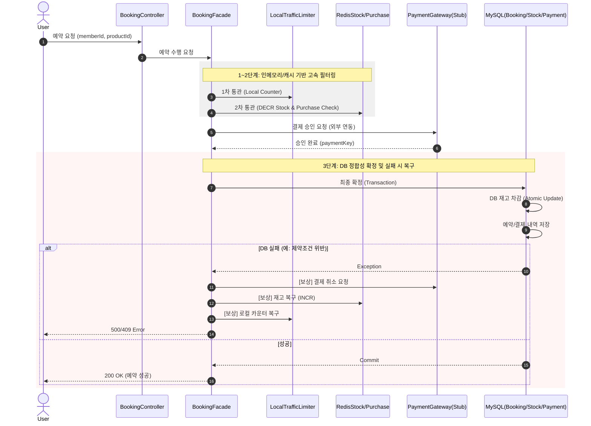

# 00:00 선착순 타임세일 예약 시스템

본 프로젝트는 초고부하가 발생하는 선착순 타임세일 환경에서 **데이터 정합성**과 **시스템 가용성**을 보장하기 위한 예약 시스템입니다.

## 1. API 목록 및 전략 분리
시스템은 조회의 부하와 예약의 부하를 분리하여 서로 다른 전략을 적용합니다.

### [GET] Checkout API (주문서 진입)
- **URL**: `/api/booking/checkout/{productId}`
- **목적**: 상품 정보(가격, 재고 현황)와 사용자의 포인트 잔액을 조회합니다.
- **전략**: **고가용성(High Availability) 조회**. 로컬 캐시(Caffeine)를 활용해 DB 부하를 최소화하며, 선착순 로직에 의한 차단 없이 모든 사용자에게 정보를 제공합니다.

### [POST] Booking API (결제 및 예약 실행)
- **URL**: `/api/booking/{productId}`
- **목적**: 실제 재고를 점유하고 결제를 진행하여 예약을 확정합니다.
- **전략**: **엄격한 정합성 및 부하 차단**. 3단계 필터링(Local -> Redis -> DB)을 통해 초과 판매를 방지하고 시스템 붕괴를 막습니다.

---

## 2. 시퀀스 다이어그램: Booking API (선착순 처리)

---

## 3. 데이터베이스 설계 (ERD)

---

## 4. 실행 방법
(중략 - 이전과 동일)
