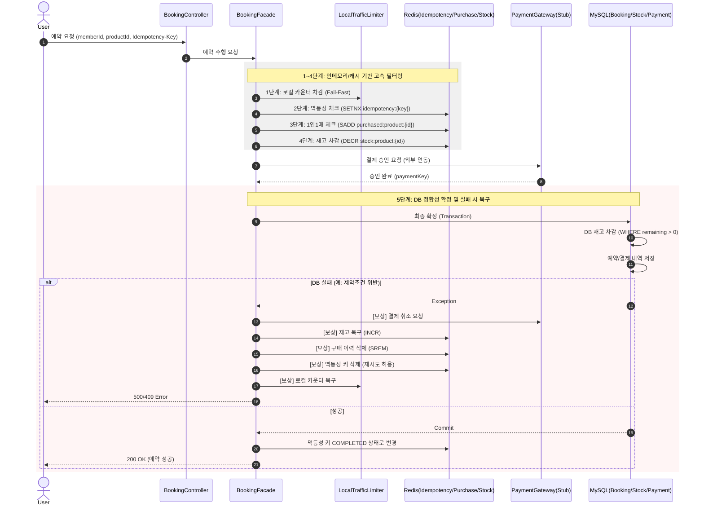
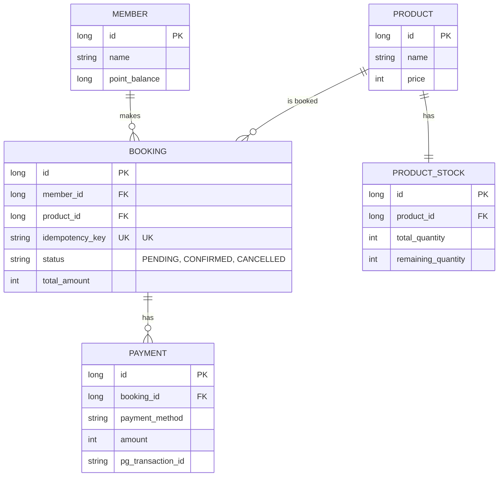

# 00:00 선착순 타임세일 예약 시스템

본 프로젝트는 초고부하가 발생하는 선착순 타임세일 환경에서 **데이터 정합성**과 **시스템 가용성**을 보장하기 위한 예약 시스템입니다.

## 1. API 목록 및 전략 분리
시스템은 조회의 부하와 예약의 부하를 분리하여 서로 다른 전략을 적용합니다.

### [GET] Checkout API (주문서 진입)
- **URL**: `/api/booking/checkout/{productId}`
- **목적**: 상품 정보(가격, 재고 현황)와 사용자의 포인트 잔액을 조회합니다.
- **전략**: **고가용성(High Availability) 조회**. 로컬 캐시(Caffeine)를 활용해 DB 부하를 최소화하며, 선착순 로직에 의한 차단 없이 모든 사용자에게 정보를 제공합니다.

### [POST] Booking API (결제 및 예약 실행)
- **URL**: `/api/booking/{productId}`
- **목적**: 실제 재고를 점유하고 결제를 진행하여 예약을 확정합니다.
- **전략**: **엄격한 정합성 및 부하 차단**. 3단계 필터링(Local -> Redis -> DB)을 통해 초과 판매를 방지하고 시스템 붕괴를 막습니다.

---

## 2. 시퀀스 다이어그램: Booking API (선착순 처리)



---

## 3. 데이터베이스 설계 (ERD)

> **BOOKING 제약 조건**: `idempotency_key` 단일 UK 외에, `(member_id, product_id)` 복합 UK가 DB 레벨 1인1매 최종 안전망으로 존재합니다.



---

## 4. 실행 방법

### 사전 준비
- Docker, Docker Compose
- Java 21

### 1단계: 인프라 기동 (MySQL + Redis Sentinel)

```bash
docker-compose up -d mysql redis-master redis-replica-1 redis-replica-2 redis-sentinel-1 redis-sentinel-2 redis-sentinel-3
```

| 서비스 | 로컬 포트 | 설명 |
|---|---|---|
| MySQL | 13306 | DB (ID: root / PW: root / DB: flashsale) |
| Redis Master | 6379 | 재고·멱등성·구매이력 저장 |
| Redis Replica | 6380, 6381 | 읽기 복제본 |
| Redis Sentinel | 26379~26381 | Master 장애 감지 및 자동 Failover |

### 2단계: 애플리케이션 실행

```bash
./gradlew bootRun
```

- 기동 시 `StockInitializer`가 DB 재고를 Redis와 로컬 카운터에 자동으로 로드합니다.
- 초기 데이터(회원 3명, 상품 1개, 재고 10개)는 `data.sql`로 자동 삽입됩니다.

> **참고**: Redis Sentinel 로컬 접속 이슈가 있는 경우 `application.properties`의 Sentinel 설정 대신 standalone 설정(`spring.data.redis.host=localhost`, `port=6379`)을 사용하세요.

### 3단계: API 호출 예시

**주문서 조회**
```bash
curl http://localhost:8080/api/booking/checkout/1?memberId=1
```

**예약 실행**
```bash
curl -X POST http://localhost:8080/api/booking/1 \
  -H "Content-Type: application/json" \
  -H "Idempotency-Key: $(uuidgen)" \
  -d '{"memberId": 1, "paymentMethods": ["CREDIT_CARD"]}'
```
